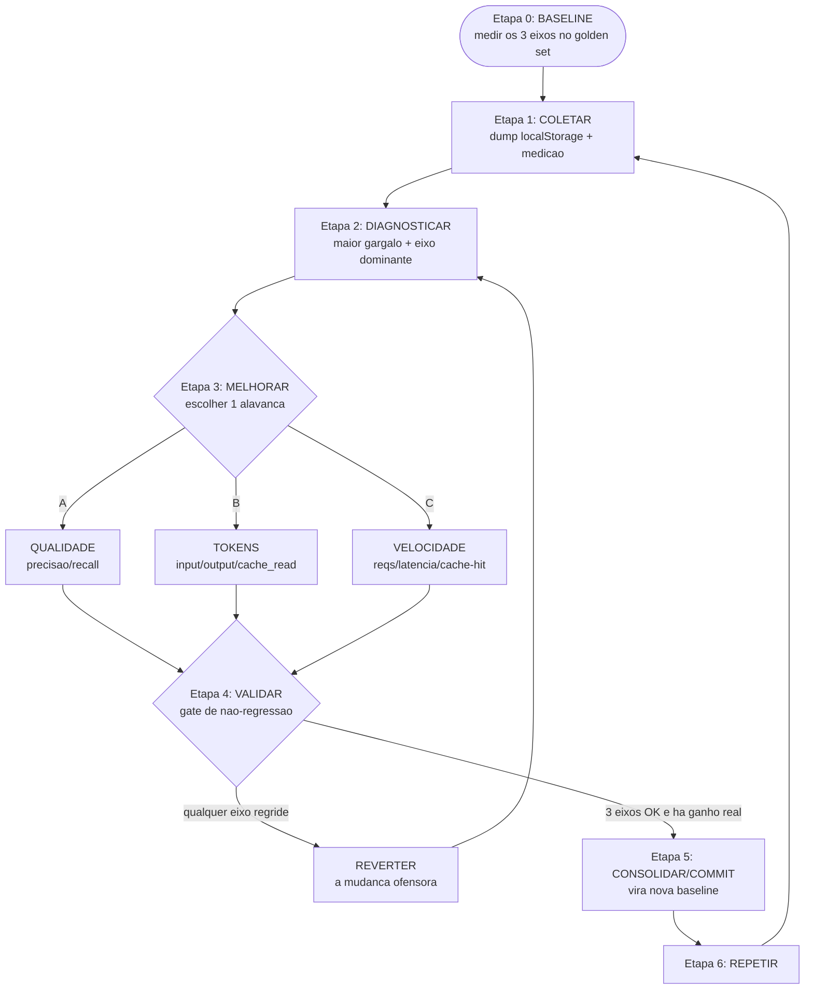

# LOOP DE MELHORIA — Cotação por IA (Atacaderj)

> Processo iterativo de melhoria contínua para a ferramenta de cotação de preços por IA
> (`cotacao-auditoria-atacaderj.html`). A cada **RODADA** o sistema fica melhor nos **3 EIXOS** —
> **VELOCIDADE**, **QUALIDADE** e **TOKENS** — **sem nunca sacrificar nenhum dos três**.
>
> Documento didático, em pt-BR. Não modifica o app: o app só muda quando uma rodada é
> **ACEITA** no gate de não-regressão (Etapa 4) e consolidada (Etapa 5).

---

## 0. Por que este loop existe

O app hoje é um **arquivo único** (`~615KB`) que chama a API da Anthropic direto do navegador.
O pipeline real é:

```
separar (separarIA, sonnet-4-6)
  -> interpretar (interpretarLote, sonnet-4-6, SÓ itens fracos: filtroLocal >= LIMIAR_INTERP=4)
  -> filtro local (candidatosDoItem = filtroLocal + candidatosFuzzy/TRIG_INDEX, coef. de Dice)
  -> busca em lote (buscaSemanticaLote, haiku-4-5, LOTE_BUSCA=15 itens/chamada)
  -> confirmação (usuário confirma o match)
  -> fallback catálogo inteiro (buscaCatalogoInteiro, sonnet-4-6, CATALOG_BLOCK ~4.4k produtos
     cacheado com cache_control ephemeral ttl 1h; 1 requisição por item, SERIALIZADA)
  -> aprende apelido (aprenderApelido(termo,cods))
```

E a **leitura de imagem** (OCR de lista manuscrita) usa `MODELO_LEITURA=claude-sonnet-4-6`,
lendo `N_LEITURAS=3` vezes (`lerImagemUmaVez`) e consolidando (`consolidarLeituras`).

A **biblioteca** que faz o sistema aprender vive HOJE só em `localStorage` (frágil, 1 dispositivo,
sem versão de schema):

| Chave localStorage        | Variável               | O que guarda                                  | Cap        |
|---------------------------|------------------------|-----------------------------------------------|------------|
| `atacaderj_apelidos`      | `_apelidos`            | Map termo -> [códigos] confirmados pelo usuário | 400        |
| `atacaderj_buscas`        | `_buscasSalvas`        | Map chaveBusca -> resultado (versionado)      | 600 / 400  |
| `atacaderj_ausentes`      | `_catInteiroAusentes`  | itens que NEM o catálogo inteiro achou        | 300        |
| `atacaderj_catalogo`      | override do catálogo   | `{produtos:[{c,p,q,v,vu}], data}`             | —          |

`atacaderj_ausentes` são as **FALHAS do fallback** — a mina de ouro do diagnóstico (Etapa 2).

Cada melhoria isolada tende a empurrar um eixo às custas de outro (ex.: mandar o catálogo inteiro
sempre melhora QUALIDADE mas explode TOKENS e VELOCIDADE). O loop existe para **só aceitar mudanças
que respeitem a regra de ouro**.

---

## A REGRA DE OURO (gate de não-regressão)

> **Comparando a rodada N com a melhor rodada ACEITA anterior (a `baseline` vigente):**
>
> 1. **QUALIDADE não pode cair** — `precisao` e `recall` da rodada N **≥** baseline (dentro da
>    tolerância definida abaixo). Acerto é rei: nunca trocamos um match certo por velocidade.
> 2. **TOKENS não pode subir** — `tokens.total_por_cotacao` da rodada N **≤** baseline.
> 3. **VELOCIDADE não pode cair** — `requisicoes_por_cotacao` **≤** baseline **e**
>    `latencia_ms_p95` **≤** baseline; `cache_hit_rate` **≥** baseline.
>
> Se **qualquer** eixo regride além da tolerância, a rodada é **REVERTIDA** — desfaz-se
> **exatamente a mudança ofensora** (não o repositório inteiro), registra-se o motivo, e volta-se
> à Etapa 2 com o aprendizado. **Uma rodada só é ACEITA se os três eixos ficam ≥ baseline
> (cada um no seu sentido de "melhor").**

### Tolerâncias (ruído de medição)

Medições com IA têm variância. Para não reprovar melhorias reais por ruído nem aprovar regressões
disfarçadas, use estas faixas (ajuste com o tempo, registrando no `_SCHEMA.md`):

| Eixo / campo                     | Direção boa | Tolerância de empate | Regride se...                          |
|----------------------------------|-------------|----------------------|----------------------------------------|
| `qualidade.precisao`             | subir       | -0.5 pp              | cair > 0.5 ponto percentual            |
| `qualidade.recall`               | subir       | -0.5 pp              | cair > 0.5 ponto percentual            |
| `tokens.total_por_cotacao`       | descer      | +2%                  | subir > 2%                             |
| `velocidade.requisicoes_por_cotacao` | descer  | +2%                  | subir > 2%                             |
| `velocidade.latencia_ms_p95`     | descer      | +5%                  | subir > 5%                             |
| `velocidade.cache_hit_rate`      | subir       | -1 pp                | cair > 1 ponto percentual              |

> **Princípio:** um eixo dentro da tolerância de empate conta como "não regrediu". Mas a rodada só
> é ACEITA se **pelo menos um eixo melhorou de forma real (fora do empate)** e **nenhum regrediu**.
> Rodada que não melhora nada (tudo empatado) é "neutra": pode ser aceita se for pré-requisito de
> outra melhoria, mas marque `veredito` com a justificativa.

---

## As 7 etapas (visão rápida)

| Etapa | Nome                 | Pergunta que responde                                  |
|-------|----------------------|--------------------------------------------------------|
| 0     | Baseline             | "Onde estamos hoje, em números?"                       |
| 1     | Coletar              | "Que dados reais de uso temos para a próxima rodada?"  |
| 2     | Diagnosticar         | "Qual é o maior gargalo agora, e em qual eixo?"        |
| 3     | Melhorar             | "Qual alavanca puxar (qualidade/tokens/velocidade)?"   |
| 4     | Validar              | "A mudança passa no gate de não-regressão?"            |
| 5     | Consolidar / commit  | "Como gravo o ganho de forma reproduzível?"           |
| 6     | Repetir              | "Qual é o próximo gargalo? (volta para a Etapa 1)"     |

---

## Etapa 0 — BASELINE

**Objetivo.** Estabelecer o ponto de partida em números, nos 3 eixos, para que toda rodada futura
tenha contra o que comparar. Sem baseline não existe "não-regressão".

**Entradas.**
- O app atual (`cotacao-auditoria-atacaderj.html`) sem nenhuma alteração.
- Um **conjunto fixo de cotações de teste** (o "golden set"): listas reais representativas
  (digitadas e manuscritas), com o resultado correto anotado à mão por quem conhece o catálogo.
  Recomenda-se 20–50 listas cobrindo: itens fáceis, itens com marca específica, variações
  (cor/sabor/gramatura), abreviações (abs, amac, qj, ral...) e itens que hoje caem no fallback.

**Saídas.**
- `metricas/rodada-000-baseline.json` preenchido (ver `metricas/_SCHEMA.md`).
- O golden set congelado e versionado (mesmas listas em toda rodada — comparar maçã com maçã).

**Como medir (instrumentação mínima, sem editar o app).**
- **Tokens / cache:** o app já tem `trackCache(usage)` somando `cache_read_input_tokens` e os
  contadores `cacheHits`, `cacheTokensSaved`. Para `input`/`output` por cotação, leia `data.usage`
  no console (ou cole o snippet de medição de uma rodada — ver Etapa 1).
- **Velocidade:** conte requisições por cotação (cada `apiCall`) e cronometre p50/p95 com
  `performance.now()` em volta das chamadas, ou via aba Network do navegador.
- **Qualidade:** rode o golden set e compare o match retornado com o gabarito → `acertos/total`,
  `precisao`, `recall`.

**Critério de aceite (objetivo).** A Etapa 0 está concluída quando:
- existe `metricas/rodada-000-baseline.json` com **todos** os campos dos 3 eixos preenchidos;
- o golden set está congelado e referenciado pelo nome no JSON;
- o `veredito` do baseline é `"baseline"` (não "aceita"/"revertida": é o marco zero).

> Os números do baseline inicial podem ser **estimados** (marcados `"baseline_a_confirmar": true`),
> mas a **primeira rodada de melhoria real só vale** depois de o baseline ser medido de verdade.

---

## Etapa 1 — COLETAR

**Objetivo.** Juntar os dados de uso real desde a última rodada, para o diagnóstico se basear em
fatos, não em palpites.

**Entradas.**
- O `localStorage` do(s) dispositivo(s) em uso: `atacaderj_apelidos`, `atacaderj_buscas`,
  `atacaderj_ausentes`, `atacaderj_catalogo`.
- Logs do console de cotações reais (rate limits, timeouts, `529`, mensagens de
  "sessão saturada" do circuito de mensagens diário).
- O golden set (sempre o mesmo).

**Saídas.**
- Um **dump** dos quatro objetos de localStorage (JSON), arquivado fora do navegador (porque o
  localStorage é frágil: 1 dispositivo, sem versão, pode ser limpo ao trocar o catálogo —
  `confirmarCatalogo()` apaga `buscas` e `ausentes`).
- Uma medição fresca dos 3 eixos rodando o golden set no app atual.

**Snippet de coleta (cole no console — somente leitura, não altera o app).**
```js
// Etapa 1 — COLETAR: dump da biblioteca (localStorage) para arquivar
copy(JSON.stringify({
  apelidos: JSON.parse(localStorage.getItem('atacaderj_apelidos')||'null'),
  buscas:   JSON.parse(localStorage.getItem('atacaderj_buscas')||'null'),
  ausentes: JSON.parse(localStorage.getItem('atacaderj_ausentes')||'null'),
  catalogo: JSON.parse(localStorage.getItem('atacaderj_catalogo')||'null'),
  cacheHits, cacheTokensSaved, buscasReusadas,
  exportadoEm: new Date().toISOString()
}, null, 2));
console.log('Dump copiado para a área de transferência.');
```

**Critério de aceite (objetivo).** Existe um arquivo com o dump da biblioteca **datado** e uma
medição dos 3 eixos da rodada anterior, ambos prontos para a Etapa 2. Sem dados frescos, **não**
se avança para diagnosticar.

---

## Etapa 2 — DIAGNOSTICAR

**Objetivo.** Achar **o maior gargalo atual** e dizer **a qual eixo** ele pertence. Uma rodada
ataca **um** gargalo principal por vez (mudanças pequenas e isoláveis são reversíveis; pacotões
não).

**Entradas.** O dump da biblioteca (Etapa 1) + a medição dos 3 eixos + o JSON da rodada anterior.

**Saídas.** Um "diagnóstico da rodada": (a) o gargalo escolhido, (b) o eixo dominante, (c) a
hipótese de causa, (d) a alavanca candidata (entrada da Etapa 3).

**Heurísticas de diagnóstico (sinais reais -> suspeita).**
- **Muitos itens em `atacaderj_ausentes`** → recall baixo no fallback: o `CATALOG_BLOCK` ou o prompt
  de `buscaCatalogoInteiro` não está achando. Eixo: **QUALIDADE** (recall).
- **`cache_hit_rate` baixo / `cacheTokensSaved` pequeno** → o cache ephemeral (ttl 1h) do
  `CATALOG_BLOCK` está expirando entre itens, ou o fallback serializado é raro demais para manter
  o cache quente. Eixo: **TOKENS** e **VELOCIDADE**.
- **`requisicoes_por_cotacao` alto** → muitos itens caindo no fallback (1 req/item serializada) ou
  poucos lotes cheios (`LOTE_BUSCA=15` subutilizado). Eixo: **VELOCIDADE**.
- **`tokens.total_por_cotacao` alto** → catálogo inteiro indo no fallback com frequência, ou
  `N_LEITURAS=3` no OCR, ou `interpretarLote` interpretando itens que nem eram fracos. Eixo: **TOKENS**.
- **Erros corrigidos pelo usuário (apelidos novos) repetindo os mesmos termos** → a busca semântica
  erra sistematicamente um padrão (ex.: certa abreviação). Eixo: **QUALIDADE** (precisão).
- **Muitos `529`/rate limit/"sessão saturada"** → volume de requisições alto demais para a sessão.
  Eixo: **VELOCIDADE** (e robustez).

**Critério de aceite (objetivo).** O diagnóstico nomeia **exatamente um** gargalo prioritário,
classifica-o em **um** dos 3 eixos como dominante, e aponta **uma** alavanca candidata da Etapa 3.
Se não dá para nomear o eixo dominante, **volte à Etapa 1** e colete mais dados — não chute.

---

## Etapa 3 — MELHORAR (as 3 alavancas)

**Objetivo.** Implementar **uma** mudança pequena e isolável que ataca o gargalo da Etapa 2, na
alavanca correspondente. Mudança isolável = fácil de reverter na Etapa 4 sem desfazer o resto.

**Entradas.** O diagnóstico da Etapa 2 (gargalo + eixo + alavanca candidata).

**Saídas.** A mudança implementada (idealmente como patch aditivo / experimento controlado) +
uma descrição curta do que mudou (vai para `descricao_mudancas` no JSON da rodada).

> **Regra de ouro aplicada aqui:** ao puxar uma alavanca, **antecipe o efeito colateral nos outros
> dois eixos** e desenhe a mudança para neutralizá-lo. Se não dá para neutralizar, espera-se que o
> gate (Etapa 4) reprove — e tudo bem, é o sistema funcionando.

### Alavanca A — QUALIDADE (precisão / recall do match)
Objetivo: acertar mais e errar menos, **sem** subir tokens nem requisições.
Ideias ancoradas no código real:
- Aumentar **recall** sem mandar catálogo inteiro: melhorar `candidatosDoItem`
  (`filtroLocal` + `candidatosFuzzy`/`TRIG_INDEX`/Dice) para trazer o candidato certo já no lote
  do haiku, tirando o item do fallback. (Sobe recall, **desce** requisições e tokens — ganha-ganha.)
- Refinar o prompt de `buscaSemanticaLote` (PRINCÍPIO 1 fronteira / PRINCÍPIO 2 variações) para
  os padrões de erro vistos na Etapa 2 (abreviações, marca vs. tipo).
- Usar mais agressivamente `_apelidos` (apelidos confirmados) **antes** de gastar uma chamada de
  IA: se o termo já tem códigos aprendidos, resolver localmente (sobe precisão, **desce** tokens e
  requisições).
Efeitos colaterais a vigiar: prompt maior sobe TOKENS; mais candidatos no lote sobe TOKENS de input.

### Alavanca B — TOKENS (input/output/cache_read por cotação)
Objetivo: gastar menos token por cotação, **sem** derrubar qualidade nem velocidade.
Ideias ancoradas no código real:
- **Manter o cache do `CATALOG_BLOCK` quente**: o `cache_control` é ephemeral ttl 1h; se o fallback
  for raro, o cache expira e cada item revira ~4.4k produtos do zero. Pré-aquecer/cutucar o cache
  (chamada com `max_tokens:1`) e **agrupar** itens de fallback no tempo aumenta `cache_read` e
  derruba o input cobrado.
- Encolher prompts repetidos (cabeçalhos do lote) sem perder os princípios de fronteira/variação.
- Reduzir `N_LEITURAS` (OCR) de 3 → 2 **somente se** a `consolidarLeituras` mantiver a qualidade
  do OCR no golden set (a Etapa 4 decide).
- Garantir que `interpretarLote` só roda em itens realmente fracos (`LIMIAR_INTERP=4`) — itens
  fortes não devem gastar interpretação.
Efeitos colaterais a vigiar: cortar leituras/candidatos pode **derrubar QUALIDADE** — por isso o gate.

### Alavanca C — VELOCIDADE (nº de requisições, latência, cache-hit)
Objetivo: menos requisições e menor p95, **sem** perder qualidade nem subir tokens.
Ideias ancoradas no código real:
- **Lotes mais cheios:** garantir que `buscaSemanticaLote` empacote perto de `LOTE_BUSCA=15`
  itens por chamada (menos requisições para o mesmo trabalho).
- **Tirar itens do fallback serializado:** cada item no `buscaCatalogoInteiro` é 1 requisição
  **em fila** (`_filaCatalogoInteiro`) — o maior dreno de latência. Resolver no filtro local / lote
  reduz drasticamente o p95.
- **Paralelizar/agrupar com cuidado** o fallback respeitando o circuito de mensagens diário
  (`_contarMsg`/`_circuitoAberto`) e o tratamento de `529`/rate limit, para não trocar latência por
  "sessão saturada".
- Reusar `_buscasSalvas` (cache de buscas versionado) mais cedo no pipeline.
Efeitos colaterais a vigiar: paralelizar demais sobe risco de rate limit; lotes grandes sobem TOKENS
de input por chamada (mas costumam **descer** o total).

**Critério de aceite (objetivo da Etapa 3).** Existe **uma** mudança implementada, isolável e
revertível, com `descricao_mudancas` escrita, atacando o eixo diagnosticado. Se a mudança mexe em
mais de uma alavanca ao mesmo tempo, **quebre em rodadas separadas** (senão a Etapa 4 não sabe qual
parte reverter).

---

## Etapa 4 — VALIDAR (o gate de não-regressão)

**Objetivo.** Decidir, com números, se a mudança da Etapa 3 **é aceita** ou **é revertida**.
Esta é a etapa que protege a regra de ouro.

**Entradas.**
- O app com a mudança da Etapa 3 aplicada.
- O **mesmo golden set** do baseline (nunca mude o golden set dentro de uma comparação).
- O JSON da melhor rodada ACEITA anterior (a baseline vigente).

**Saídas.**
- `metricas/rodada-NNN-<slug>.json` com os 3 eixos medidos **e** o campo `veredito`
  (`"aceita"` ou `"revertida"`).
- Se revertida: a anotação de **qual eixo regrediu** e de que a **mudança ofensora foi desfeita**.

**Procedimento do gate (determinístico).**
1. Rode o golden set 3× (para média estável) e registre médias de cada campo.
2. Compare campo a campo com a baseline usando a tabela de **tolerâncias** da Regra de Ouro.
3. Aplique a decisão:
   - **Todos os eixos ≥ baseline (no sentido bom) E pelo menos um melhorou de verdade →** `aceita`.
   - **Qualquer eixo regrediu além da tolerância →** `revertida`.
   - **Tudo empatado (neutra) →** aceitar só se for pré-requisito de outra melhoria; senão,
     `revertida` com motivo "sem ganho".

```
PSEUDO-GATE
função avaliarRodada(rodada, baseline):
    regrediu = []
    se rodada.qualidade.precisao  < baseline.qualidade.precisao - 0.5: regrediu += "precisao"
    se rodada.qualidade.recall    < baseline.qualidade.recall   - 0.5: regrediu += "recall"
    se rodada.tokens.total_por_cotacao        > baseline.tokens.total_por_cotacao        * 1.02: regrediu += "tokens"
    se rodada.velocidade.requisicoes_por_cotacao > baseline.velocidade.requisicoes_por_cotacao * 1.02: regrediu += "requisicoes"
    se rodada.velocidade.latencia_ms_p95      > baseline.velocidade.latencia_ms_p95      * 1.05: regrediu += "latencia_p95"
    se rodada.velocidade.cache_hit_rate       < baseline.velocidade.cache_hit_rate       - 0.01: regrediu += "cache_hit"
    se regrediu não vazio:
        return "revertida", regrediu      // -> desfazer a MUDANÇA OFENSORA
    se algumEixoMelhorouForaDoEmpate(rodada, baseline):
        return "aceita", []
    return "revertida", ["sem ganho"]
```

**O que fazer quando um eixo regride.**
1. **Reverter exatamente a mudança ofensora** da Etapa 3 (não o repositório inteiro). Como cada
   rodada é uma mudança isolável, isso é um "desfazer" cirúrgico.
2. Registrar no JSON: `veredito: "revertida"`, e em `descricao_mudancas` anotar **qual eixo caiu e
   por quê** (a hipótese de causa).
3. Voltar à **Etapa 2** com esse aprendizado: muitas vezes a próxima tentativa é a mesma alavanca
   com a mudança redesenhada para neutralizar o efeito colateral.

**Critério de aceite (objetivo da Etapa 4).** Existe um JSON de rodada com `veredito` definido por
ESTE procedimento (não por "achismo"), e — se revertida — a mudança ofensora já está fora do app.

---

## Etapa 5 — CONSOLIDAR / COMMIT

**Objetivo.** Gravar o ganho de forma reproduzível e tornar a rodada ACEITA a **nova baseline**.

**Entradas.** A rodada `aceita` (app alterado + JSON de métricas).

**Saídas.**
- Commit com a mudança do app **e** o `metricas/rodada-NNN-<slug>.json` juntos (a métrica é a prova
  do commit).
- A rodada aceita passa a ser a **baseline vigente** para a próxima comparação.
- (Quando a biblioteca migrar de localStorage para algo versionado/multi-dispositivo, este é o
  ponto de também versionar o schema da biblioteca.)

**Mensagem de commit (modelo).**
```
rodada NNN: <eixo dominante> — <o que mudou em 1 linha>

Qualidade: precisao X.X% -> Y.Y% | recall ...
Tokens:    total/cotacao A -> B (-Z%)
Velocidade: req/cotacao ... | p95 ... | cache_hit ...
Veredito: aceita (gate de não-regressão OK)
```

**Regra:** rodada `revertida` **não** vira baseline e idealmente **não** entra no app (só o JSON é
arquivado, como registro do experimento que falhou).

**Critério de aceite (objetivo).** Commit feito contendo (app + JSON da rodada), a rodada está
marcada `aceita`, e o ponteiro de "baseline vigente" aponta para ela.

---

## Etapa 6 — REPETIR

**Objetivo.** Fechar o ciclo: o próximo gargalo (que pode ser em outro eixo agora) vira a próxima
rodada.

**Entradas.** A nova baseline (Etapa 5) + o app em uso gerando novos dados.

**Saídas.** Início de uma nova rodada `NNN+1` na Etapa 1.

**Critério de aceite (objetivo).** A rodada `NNN+1` está aberta na Etapa 1 com coleta de dados
frescos. O loop nunca "termina": ele converge — as melhorias ficam menores, mas os 3 eixos nunca
andam para trás.

> **Rotação dos eixos (recomendado):** se duas rodadas seguidas atacaram TOKENS, force a próxima a
> olhar QUALIDADE ou VELOCIDADE. Assim nenhum eixo fica esquecido e a regra de ouro vira hábito.

---

## Diagrama do loop (Mermaid)



## Diagrama do loop (ASCII — fallback)

```
            +----------------------------------+
            |  ETAPA 0: BASELINE               |
            |  medir os 3 eixos no golden set  |
            +----------------------------------+
                          |
                          v
            +----------------------------------+
   +------> |  ETAPA 1: COLETAR                |
   |        |  dump localStorage + medicao     |
   |        +----------------------------------+
   |                      |
   |                      v
   |        +----------------------------------+
   |  +---> |  ETAPA 2: DIAGNOSTICAR           |
   |  |     |  maior gargalo + eixo dominante  |
   |  |     +----------------------------------+
   |  |                   |
   |  |                   v
   |  |     +----------------------------------+
   |  |     |  ETAPA 3: MELHORAR (1 alavanca)  |
   |  |     |  [A] QUALIDADE precisao/recall   |
   |  |     |  [B] TOKENS in/out/cache_read    |
   |  |     |  [C] VELOCIDADE reqs/lat/cache   |
   |  |     +----------------------------------+
   |  |                   |
   |  |                   v
   |  |     +----------------------------------+
   |  |     |  ETAPA 4: VALIDAR (o gate)       |
   |  |     |  qualidade nao cai?              |
   |  |     |  tokens nao sobe?                |
   |  |     |  velocidade nao cai?            |
   |  |     +----------------------------------+
   |  |        |                        |
   |  |  REGREDIU                    3 EIXOS OK
   |  |  (reverter a                 + ganho real
   |  |   mudanca ofensora)             |
   |  +-------+                         v
   |          (volta p/ Etapa 2)  +----------------------------------+
   |                              |  ETAPA 5: CONSOLIDAR / COMMIT    |
   |                              |  vira a nova baseline            |
   |                              +----------------------------------+
   |                                         |
   |                                         v
   |                              +----------------------------------+
   |                              |  ETAPA 6: REPETIR                |
   +------------------------------|  proximo gargalo -> Etapa 1      |
                                  +----------------------------------+

  REGRA DE OURO: qualidade NAO pode cair, tokens NAO pode subir, velocidade NAO pode cair.
  Se qualquer eixo regride -> REVERTER exatamente a mudanca ofensora e voltar a diagnosticar.
```

---

## Resumo de uma página (para colar na parede)

1. **Baseline**: meça os 3 eixos no golden set congelado.
2. **Coletar**: dump do localStorage + medição fresca.
3. **Diagnosticar**: um gargalo, um eixo dominante.
4. **Melhorar**: uma alavanca (A qualidade / B tokens / C velocidade), mudança isolável.
5. **Validar**: gate — qualidade não cai, tokens não sobe, velocidade não cai. Senão, **reverte**.
6. **Consolidar**: commit (app + JSON), vira nova baseline.
7. **Repetir**: próximo gargalo.

> **Os 3 eixos são sagrados. Nenhuma rodada anda para trás em nenhum deles.**
